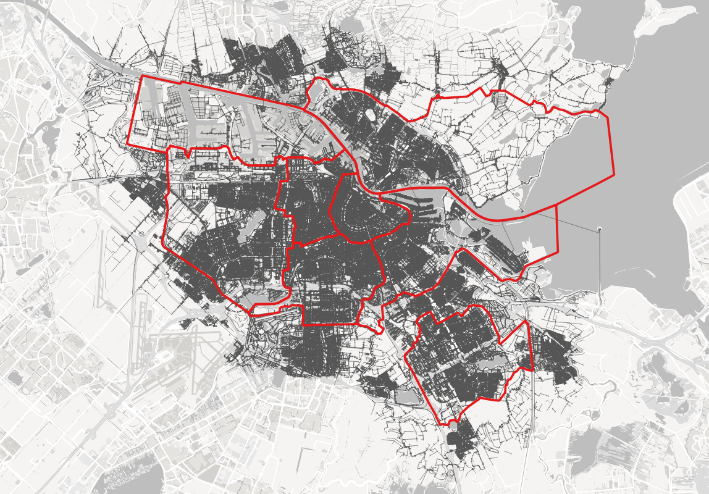
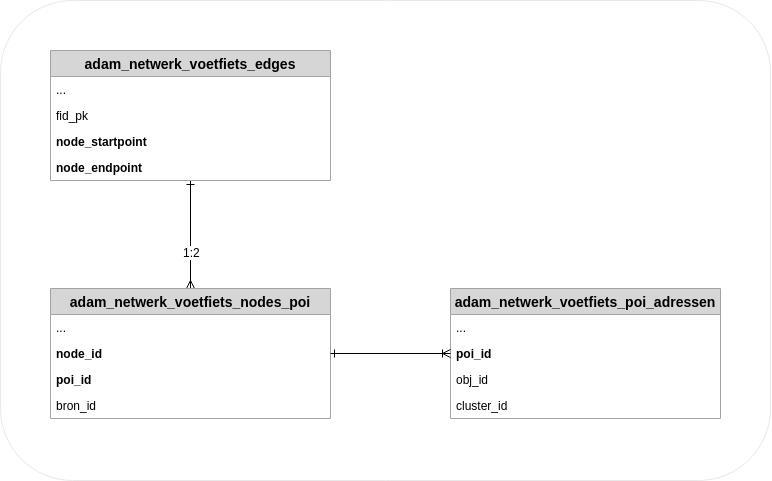

# Loop- en fietsnetwerk Amsterdam

##  Contents 
 - section 1. [Beschrijving datasets](#section_1)
 - section 2. [Demo Jupyter notebook](#section_2)
 - section 3. [Voorbereiden python omgeving](#section_3)

##  Beschrijving datasets
Het loop- en fietsnetwerk is afgeleid uit Openstreetmap (OSM) en Basisregistratie Grootschalige Topografie (BGT).
Alle adresseerbare objecten (verblijfsobject, lig- en standplaats) in Amsterdam met adressen (POI) zijn gekoppeld aan dit netwerk.
Het aandachtgebied betreft Amsterdam en een deel van de omliggende woonplaatsen. Zie afbeelding.

De dataset bestaat uit drie layers:
 - [adam_netwerk_voetfiets_edges](doc/edges.md)
 - [adam_netwerk_voetfiets_nodes_poi](doc/nodes_poi.md)
 - [adam_netwerk_voetfiets_poi_adressen](doc/poi_adressen.md)

Aantallen (afgerond):

 - adressen:   606,500 
 - edges:    1,985,000
 - nodes:    1,454,500

Categorie poi:
|*poi_type*   |*aantal*|
| :------------- | -----------: |
|adr_grens  | 64432|
|lps        |  2903|
|sps        |   330|
|vot_cluster|158923|
|ov_halte   |  1628|

De dataset is te dowladen via [data.amsterdam.nl](https://data.amsterdam.nl/datasets/7hGzsRXqWSGqHw/loop-en-fietsnetwerk-amsterdam/)

De **edges** (aslijnen wegen) zijn gerelateerd aan de nodes via:
edges.node_startpoint = nodes_poi.node_id en
edges.node_endpoint = nodes_poi.node_id

De nodes en pois zijn geintegreerd 1 in tabel, **nodes_poi**.
Alle pois van het type vot_cluster, ligplaats en standplaats hebben een relatie naar **poi_adressen**. Deze relatie loopt als volgt:
nodes_poi.poi_id = poi_adressen.poi_id.

De pois van het type vot_cluster (cluster van verblijfsobjecten) hebben vaak een relatie van 1:n. Een cluster heeft een relatie met meerdere adressen.

In de onderstaande afbeelding worden de relaties schematisch weergegeven.

##  Demo jupyter notebook
Go back to [table of Contents](#top_row)

Het notebook laat de mogelijkheden zien van de dataset.  
Op basis van een uitsnede wordt met een Breath-First algoritme een afstandsmatrix opgebouwd.
Het notebook vind je onder:  
notebook/demo_network_analysis_custom_bfs.ipynb

##  Voorbereiden python omgeving
Go back to [table of Contents](#top_row)

### Virtuele omgeving
Python maakt gebruik van virtuele omgevingen. Binnen deze demo wordt gebruik gemaakt van python venv.  
Installatie
 - creatie virtuele omgeving met venv (of anaconda): /environment/create_venv_distance_analysis.sh
 - activeren python omgeving: <code>source somewhere/pynetworkanalysis/bin/activate</code>
 - installeren vereiste python packages: <code>pip install -r requirements.txt</code>
